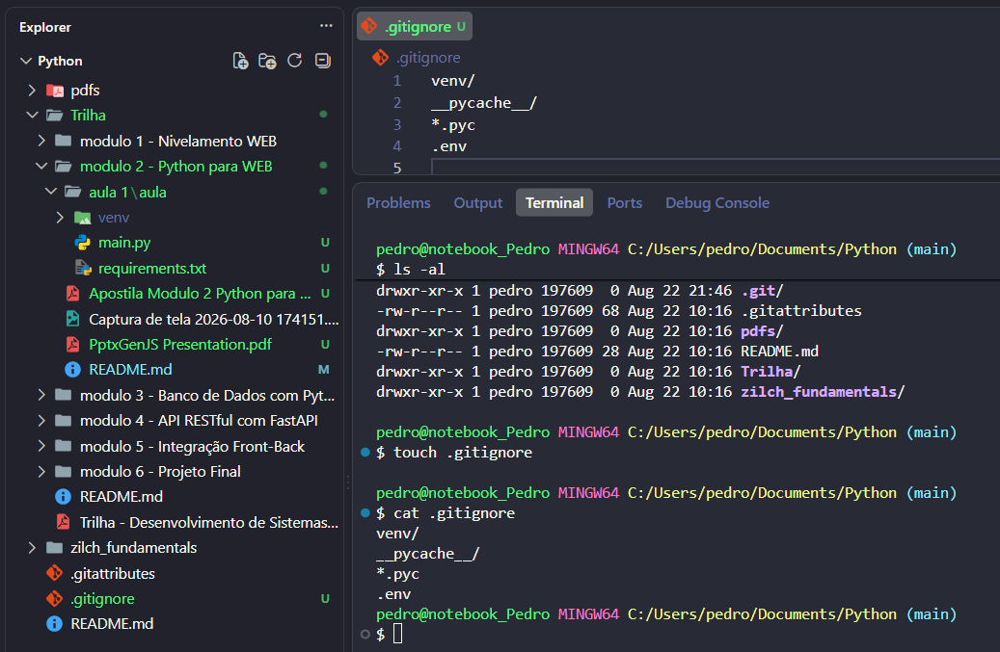

# Ambiente Virtual:
```bash
# so crie na msm pasta que vai ter a aplicação
python -m venv venv             # criar ambiente virtual
source venv/Scripts/active      # ativar ambiente virtual

deactive                        # desativar ambiente virtual
```
<br>

# Depedencias:
```bash
        # Depois de entrar no ambiente virtual

python.exe -m pip install --upgrade pip # upgrade no pip

pip install fastapi uvicorn     # instalar as depedencias para o desevolvimento

pip list                        # lista todos as bibliotecas instaladas

pip freeze > requirements.txt   # salva as verções especificas das depedencias na file requirements.txt

pip install -r requirements.txt # submete o ambiente venv a aqls configs
```
<br>

# GitIgnore

O .gitignore é um arquivo para de configuração que diz quais pastas ou arquivos não devem ser enviados para o repositorio na nuvem, deve ser uma lista em que cada file ou directory fica em uma linha propria.



## **ALERTA**
```bash
alem de ser apenas um file .gitignore por repositorio, o file deve estar 'exclusivamete' na raiz do diretorio (onde fica o diretorio .git)
```
<br>

# Fluxo
depois do projeto ja estar no repositorio na nuvem:
```bash

git clone url_repository                # clonar repositorio
cd repository                           # entrar na pasta
python -m venv venv                     # criar ambiente pra aplicação
source venv/Scrpit/active               # ativar ambiente virtual
pip install -r requirements.txt         # instalar depedencias da aplicação

```
<br>

# Uvicorn
Um servidor Web para rodar junto com o *FastAPI*, para ativar:
```bash
# Sempre rode depois de ativar o venv e baixar as depedencias, deixe rodando em segundo plano para testar a API
# tbm sempre rode na msm pasta que o arquivo main.py esta

uvicorn main:app --reload               # :app é o nome da API que criamos no file main.py da aula 1

```